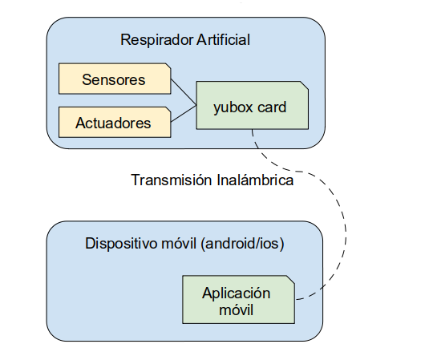

SOFTWARE
########

APLICACIÓN MOVIL
================

DESCRIPCIÓN GENERAL
-------------------

La aplicación móvil OpenVenti tiene como finalidad el monitoreo y administración del respirador artificial del mismo nombre, de forma segura e intuitiva.

El sistema estará constituido por los siguientes componentes:

**Estructura de la Aplicación**

FLUJO DE TRABAJO
----------------

USUARIOS
^^^^^^^^

EMPAREJAMIENTO
^^^^^^^^^^^^^^

VISUALIZACIÓN DE DATOS
^^^^^^^^^^^^^^^^^^^^^^

TRANSIMISIÓN DE DATOS
^^^^^^^^^^^^^^^^^^^^^

Se usara tecnología Wifi, aplicando norma ANSI/TIA 1149, motivo controlar que el espectro radioeléctrico y no obstaculizar conexión de otros equipos, incluso otros ventiladores.

La norma ANSI/TIA 1149 se usa para Servicio de Alerta Móvil Comercial (CMAS) sobre los sistemas CDMA 

RECEPCIÓN DE DATOS
^^^^^^^^^^^^^^^^^^

PANEL DE ADMINISTRACIÓN
^^^^^^^^^^^^^^^^^^^^^^^

CIERRE DE CESIÓN
^^^^^^^^^^^^^^^^

TRATAMIENTO DEL PACIENTE
------------------------

HISTORIA CLÍNICA
^^^^^^^^^^^^^^^^

Número que identifica de manera única al paciente, incluso si regresa a la Institución. 
Puede ser utilizado el número de DNI. A obtener del HIS del lugar de atención.

TESTING
-------

**Ambiente IOS**

**Ambiente Android**

.. include:: api.rst

.. include:: webserver.rst